# GreenMart - Splash & Onboarding Module

This repository contains the Flutter implementation of the GreenMart application, focusing on a premium first-time user experience. The entry flow is designed to build brand trust and guide users through the core value propositions of the platform.

## 🖼️ Screenshots

  
  
  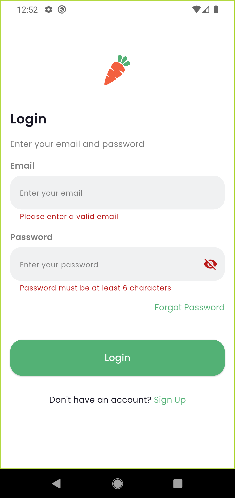
  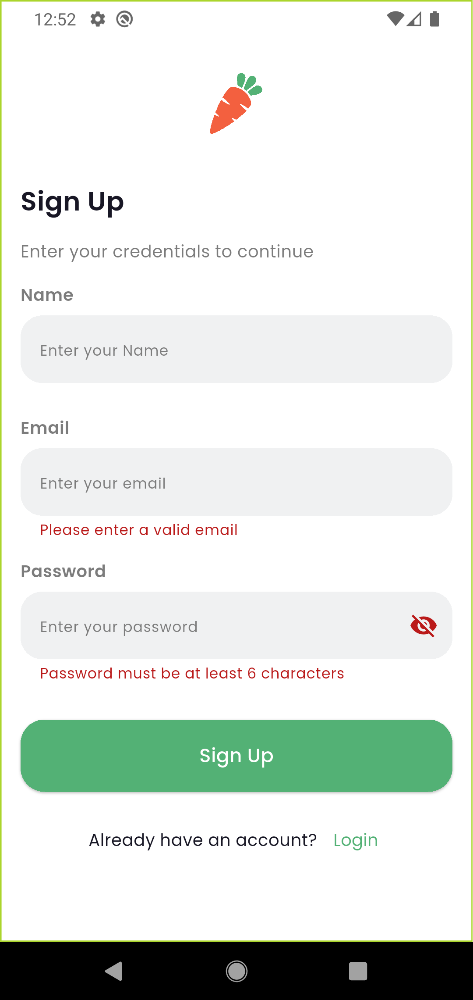
  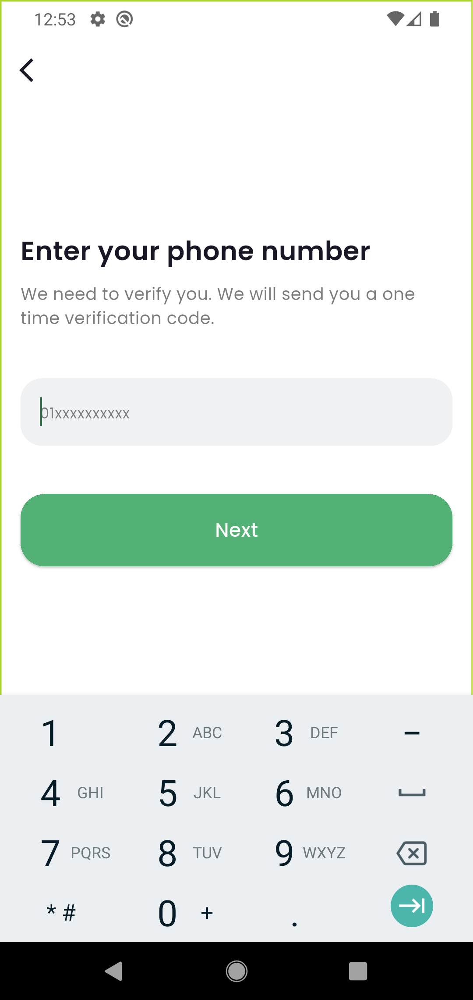
  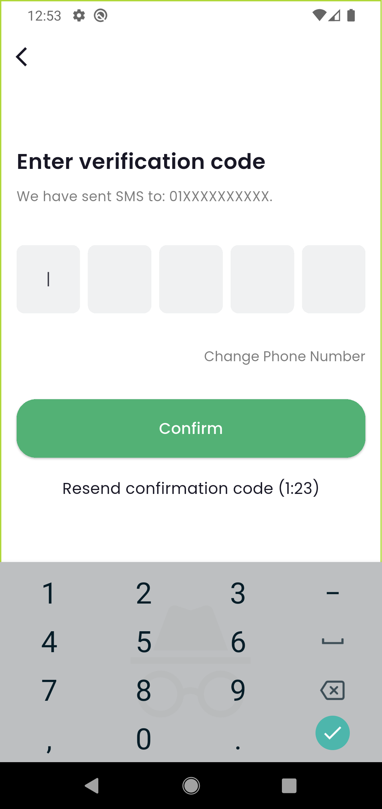
  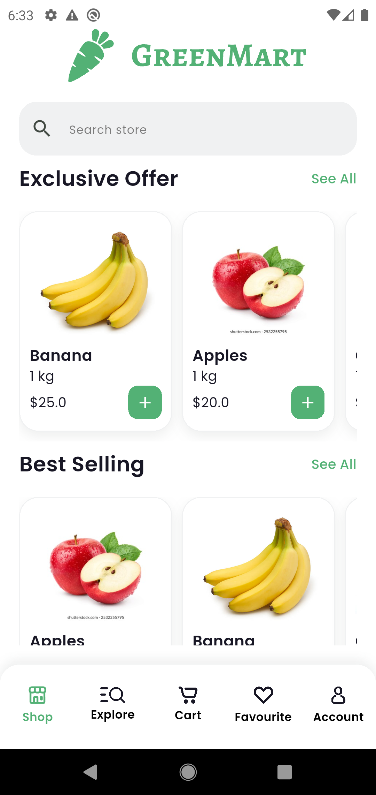
  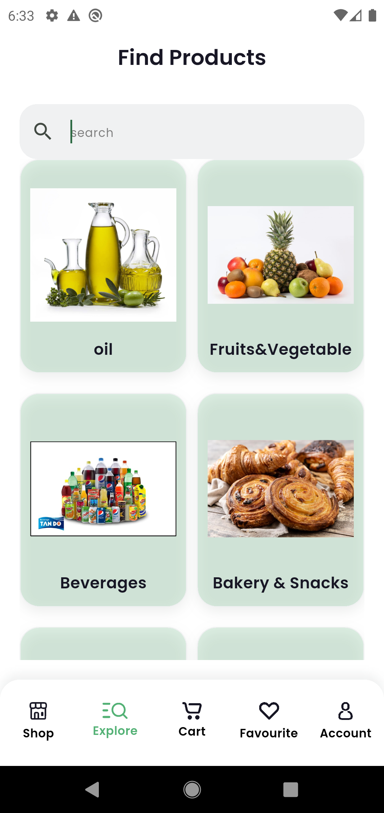
  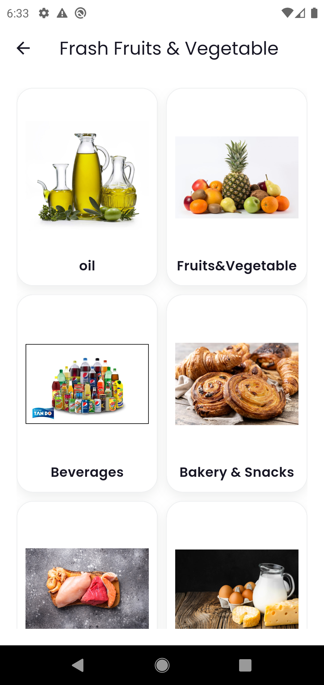
  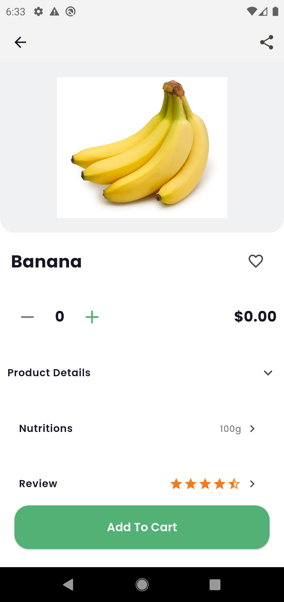
  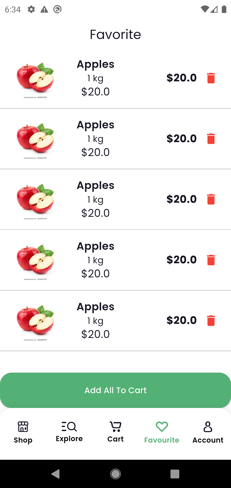
  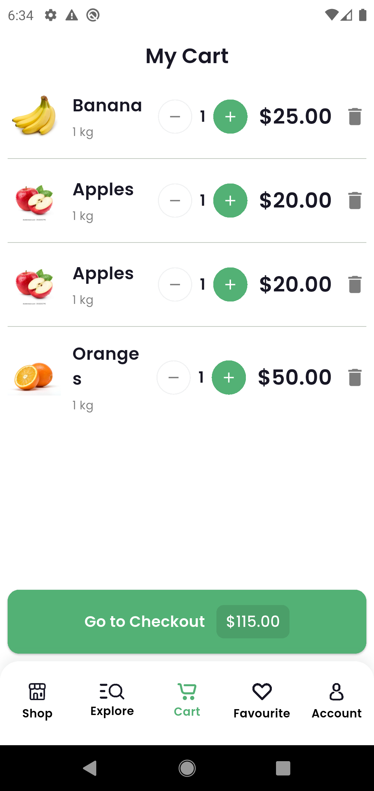
  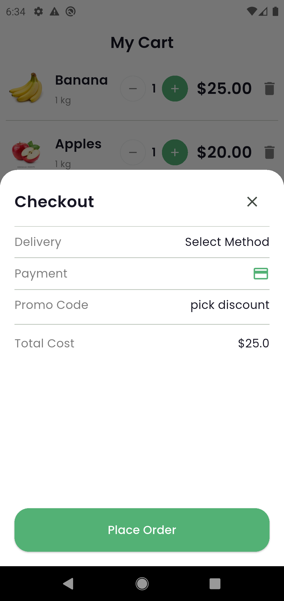
  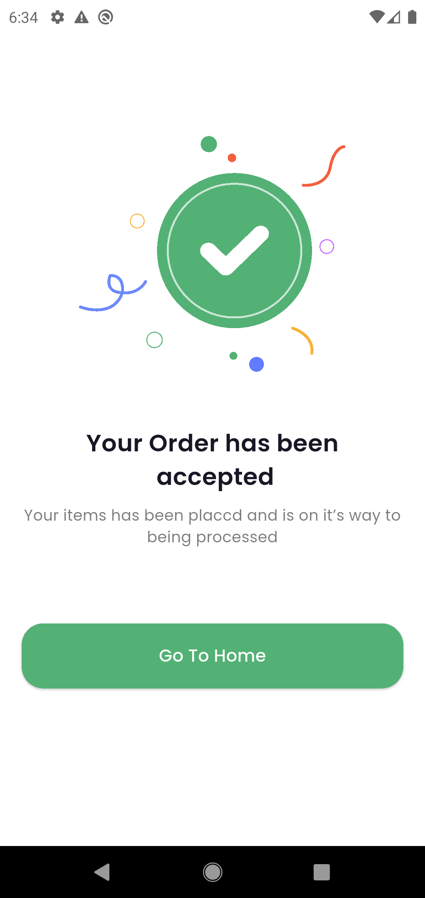
  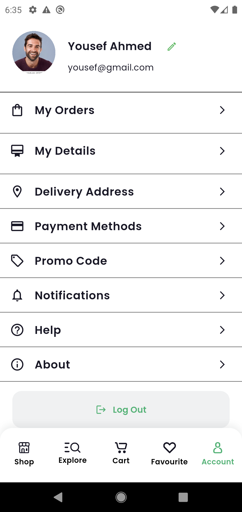

🛠 Features
1. Splash Screen
The entry point of the application (lib/features/splash).

Branding: Displays the GreenMart central logo with a clean, minimalist background.

Navigation Logic: Includes a timed transition (usually 2-3 seconds) that checks the user's "first-time" status.

Smooth Transitions: Uses Flutter's PageRouteBuilder or standard navigation for a seamless fade-into-onboarding experience.

2. Onboarding Experience
The educational walkthrough (lib/features/onboarding).

Pageview Implementation: A smooth horizontal scroll/swipe mechanism to navigate through benefit slides.
3. login screen
4. sign up screen
5. phone number screen 
6. verfication by otp 

🚀 How to Run
Clone the repo: git clone https://github.com/Yousefahmed168/green_mart.git

Install dependencies: flutter pub get

Run the app: flutter run